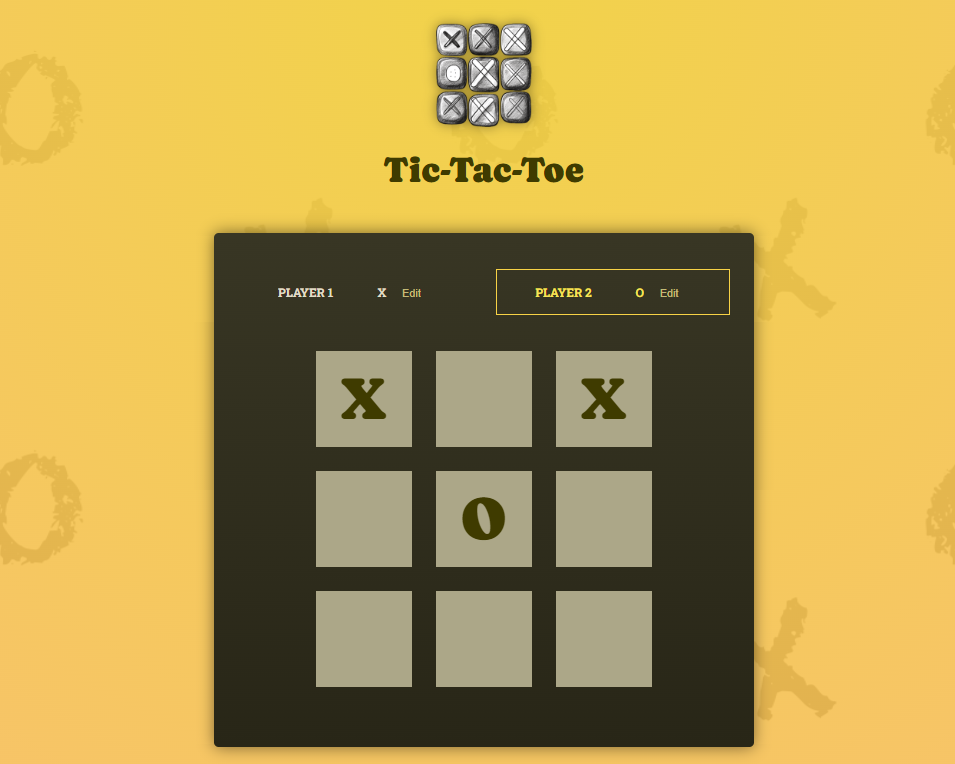

# Tic-Tac-Toe React demo

## Overview

A sample application built whilst running through an on-demand React training course. It provides an example of learning new tech in a short amount of time and demonstrates exposure to core React & JavaScript concepts such as components, state, working with state + functionality across a component hierarchy, scoping of resources and more.

## How to run this application

For the purposes of this demo, we recommend you:

1. Clone this repo
2. Open up the repo in VS Code
3. Run the `npm install` command in the VS Code terminal
4. Run the `npm run dev` command (in the terminal) to run the application

## Example

## Contact us

<a href="sales@adept-itc.com">Contact us today</a> for assistance, help and to find out how we can apply these concepts in your software solution.